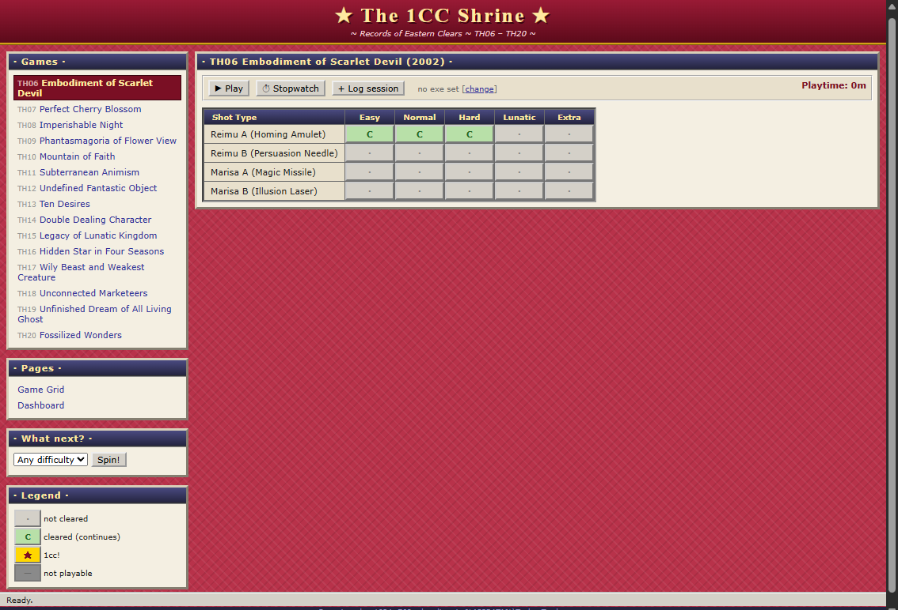

# The 1CC Shrine ~ Records of Eastern Clears

A desktop application for the games of [Touhou Project](https://en.touhouwiki.net/)
1cc progress for every shot type, every difficulty, TH06 through TH20. Click a
cell when you clear something and watch it be filled with stars.

It was styled in the idea of that golden age of web design look since I am a particular fan of it.



## What it does

- **The grid** - shot types * difficulties for every game listed. Click each cell to cycle through. There are a few weird exceptions, which should be accounted for.
- **Dashboard** - completion percentages per game and per difficulty, with
  progress bars and playtime totals.
- **"What next?"** - can't decide what to grind? Spin the wheel and get a
  random uncleared cell, filterable by difficulty. Hope you don't roll UFO Lunatic.
- **Playtime tracking** - point each game at its exe (vanilla, vpatch, or a
  thcrap loader — it follows the real game process even when the loader
  bails instantly) and hit Play. Sessions are timed until the game closes.
  There's also a stopwatch and manual entry for sessions played elsewhere, just in case.
- Everything lives in a small SQLite database in `%APPDATA%\TouhouTracker`,
  so your records survive updates and rebuilds.

## Running from source

You'll need Python 3.10+ on Windows.

```
pip install -r requirements.txt
python app.py
```

That's all you need.

To build a standalone exe:

```
pip install pyinstaller
pyinstaller 1cc_shrine.spec
```

The result lands in `dist\1CCShrine.exe`.

## Just want the exe?

Grab the latest build from the
[Releases page](https://github.com/OhMellie/the-1cc-shrine/releases) -
no Python required.

## License

[MIT](LICENSE). Touhou Project belongs to ZUN / Team Shanghai Alice; this is
just a fan-made progress tracker and isn't affiliated with them in any way.
